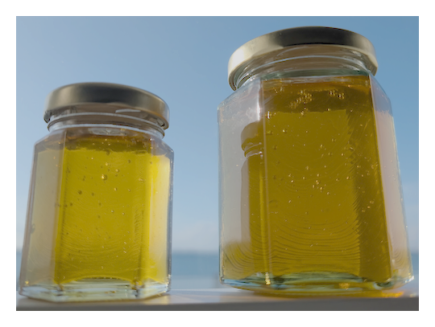
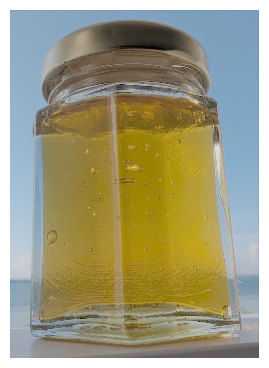
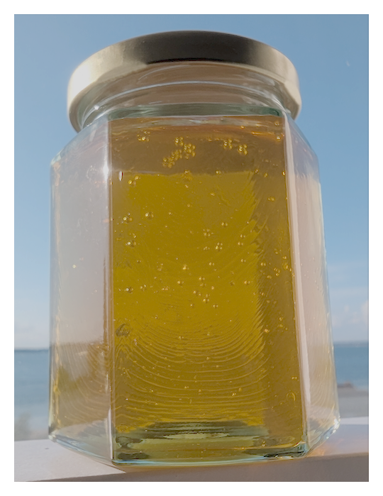

* [Contact us](/contact/)

Organic Honey produced in Cowes on the Isle of Wight in the South of England.

We use [Flow Hives](https://uk.honeyflow.com/) which are developed by an Australian father and son team to make life easier for the bees and the apiarist.

This means we harvest our honey directly from the hive frames into jars without disturbing the bees or needing to remove frames, cap them and spin the honey out.

The Flow Hive design is to have preformed hexagons in the honey super (top box) which the bees use to store honey. When the frame is full and the bees have capped off (sealed the comb with wax) we can then attach a short pipe to the back of the frame via an access hatch, twist a 'key' in the top of the frame which splits all the cells in the frame, meaning the honey flows to the bottom and out of the back of the frame directly into a jar.

We have two jar sizes:

## 250g Organic Honey

### &pound;8

Pay by PayPal: [https://paypal.me/iowhoney/8](https://paypal.me/iowhoney/8)

or pay on delivery

## 500g Organic Honey

### &pound;14

Pay by PayPal: [https://paypal.me/iowhoney/14](https://paypal.me/iowhoney/14)

or pay on delivery

Delivery by arrangement: [contact@wightgoldhoney.com](mailto:contact@wightgoldhoney.com)
